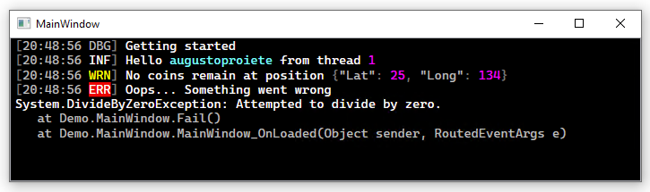

| README.md |
|:---|

<div align="center">


</div>

<h1 align="center">Serilog.Sinks.RichTextBox.Wpf</h1>
<div align="center">

A [Serilog](https://serilog.net) sink that writes log events to any WPF [RichTextBox](https://docs.microsoft.com/en-us/dotnet/desktop/wpf/controls/richtextbox-overview?view=netframeworkdesktop-4.8) control with coloring and custom theme support.

[](https://www.nuget.org/packages/Serilog.Sinks.RichTextBox.Wpf) [](https://dotnet.microsoft.com/download) [](https://dotnet.microsoft.com/download) [](https://dotnet.microsoft.com/download) [](http://stackoverflow.com/questions/tagged/serilog)



</div>

## Give a Star! :star:

If you like or are using this project please give it a star. Thanks!

## Getting started :rocket:

Install the [Serilog.Sinks.RichTextBox.Wpf](https://www.nuget.org/packages/Serilog.Sinks.RichTextBox.Wpf) package from NuGet:

```powershell
Install-Package Serilog.Sinks.RichTextBox.Wpf -Prerelease
```

Declare your [RichTextBox](https://docs.microsoft.com/en-us/dotnet/desktop/wpf/controls/richtextbox-overview?view=netframeworkdesktop-4.8) control and give it a name that you can reference it from the code-behind. e.g.:

```xml
<Window (...)>
  <RichTextBox
      x:Name="MyRichTextBox"
      Background="Black"
      Foreground="LightGray"
      FontFamily="Cascadia Mono, Consolas, Courier New, monospace"
      VerticalScrollBarVisibility="Auto"
  />
</Window>
```

Then enable the sink using `WriteTo.RichTextBox()`:

```csharp
Log.Logger = new LoggerConfiguration()
    .WriteTo.RichTextBox(MyRichTextBox)
    .CreateLogger();

Log.Information("Hello, world!");
```

Log events will be written to the `RichTextBox` control:

```
[11:54:36 INF] Hello, world!
```

### Themes

The sink will colorize output by default:


Themes can be specified when configuring the sink:

```csharp
    .WriteTo.RichTextBox(MyRichTextBox, theme: RichTextBoxConsoleTheme.Grayscale)
```

The following built-in themes are available at this time:

| Theme                               | Description
| ----------------------------------- | --------------------------------------------------------------------------------------------------------------------- |
| `RichTextBoxTheme.None`             | No styling. Uses default styles applied to the `RichTextBox` control                                                  |
| `RichTextBoxConsoleTheme.Literate`  | Styled to replicate the default theme of  _Serilog.Sinks.Console_; **This is the default when no theme is specified** |
| `RichTextBoxConsoleTheme.Grayscale` | A theme using only shades of gray, white, and black                                                                   |
| `RichTextBoxConsoleTheme.Colored`   | A theme based on the original `Serilog.Sinks.ColoredConsole` sink                                                     |

 Adding a new theme is straightforward; examples can be found in the [`RichTextBoxConsoleThemes`](src/Serilog.Sinks.RichTextBox.Wpf/Sinks/RichTextBox/Themes/RichTextBoxConsoleThemes.cs) class.

### Output templates

The format of events to the RichTextBox can be modified using the `outputTemplate` configuration parameter:

```csharp
    .WriteTo.RichTextBox(MyRichTextBox,
        outputTemplate: "[{Timestamp:HH:mm:ss} {Level:u3}] {Message:lj}{NewLine}{Exception}")
```

The default template, shown in the example above, uses built-in properties like `Timestamp` and `Level`. Properties from events, including those attached using [enrichers](https://github.com/serilog/serilog/wiki/Enrichment), can also appear in the output template.

## Release History

Click on the [Releases](https://github.com/serilog-contrib/serilog-sinks-richtextbox/releases) tab on GitHub.

---

_Copyright &copy; 2021-2023 C. Augusto Proiete & Contributors - Provided under the [Apache License, Version 2.0](LICENSE)._
